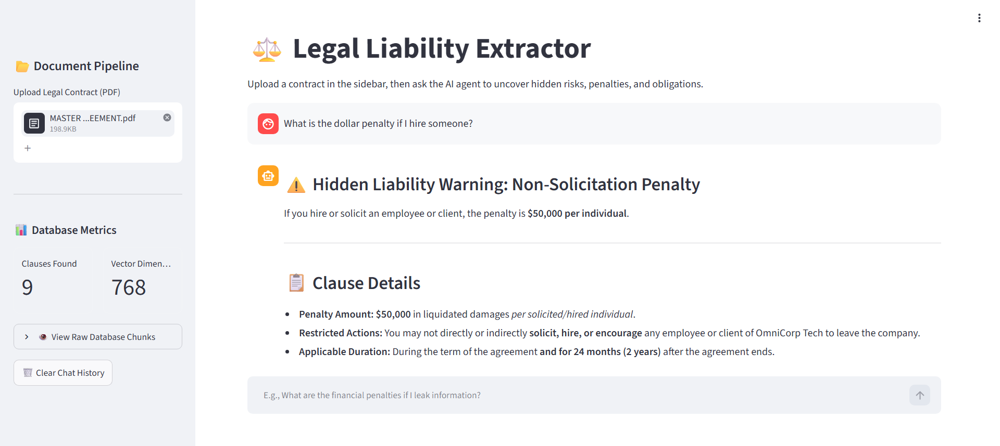
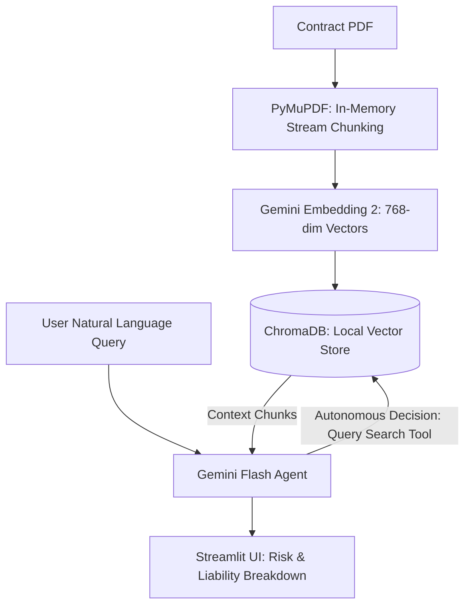

# ⚖️ Legal Liability Extractor

An autonomous AI agent built to parse, analyze, and extract hidden liabilities from legal contracts. This project demonstrates a complete Retrieval-Augmented Generation (RAG) architecture, evolving from basic API integration into a full-stack, agentic web application. 

The system replaces manual document review by utilizing local vector embeddings and an agentic reasoning loop to warn users of uncapped financial risks, aggressive audit rights, and restrictive intellectual property clauses.


## 🚀 Key Features

*   **Autonomous Tool Calling:** The core agent dynamically generates its own search queries, deciding *when* and *what* to query in the vector database to resolve complex legal ambiguities.
*   **Privacy-Preserving Local RAG:** Parses and chunks PDF documents entirely on local compute before embedding, avoiding unnecessary data exposure.
*   **Multi-Turn Conversational Memory:** Maintains state across interactions, allowing users to ask natural follow-up questions without losing contextual awareness of the contract.
*   **Interactive UI:** A Streamlit dashboard featuring live database metrics, raw-chunk viewers, and real-time visualization of the agent's background API calls.
*   **Optimized Resource Management:** System prompts constrain the agent to consolidate legal concepts into broader queries, preventing API rate-limit exhaustion.

## 🏗️ Development Lifecycle

The repository is structured sequentially to document the software development progression:
*   **Day 1 & 2:** Initial setup, Gemini API smoke tests, and text embedding generation.
*   **Day 3 & 4:** Implementation of the local ChromaDB vector store and robust PyMuPDF contract chunking.
*   **Day 5 & 6:** Integration of the PDF parser with vector ingestion and the baseline RAG generation pipeline.
*   **Day 7:** Upgrade to multi-turn conversational memory and autonomous agentic tool calling.
*   **Day 8 (app.py):** Final deployment of the Streamlit frontend application.
  
## 📐 System Architecture




## 🛠️ Technology Stack

*   **Language:** Python 3.x
*   **Frontend Interface:** Streamlit
*   **Document Parsing:** PyMuPDF (`fitz`)
*   **Vector Database:** ChromaDB
*   **Embeddings Engine:** Google `gemini-embedding-2`
*   **LLM / Reasoning Agent:** Google `gemini-3.6-flash`

## 📦 Installation & Setup

1. **Clone the repository:**
   ```bash
   git clone https://github.com/pranjalbatule/legal-liability-extractor.git
cd legal-liability-extractor
